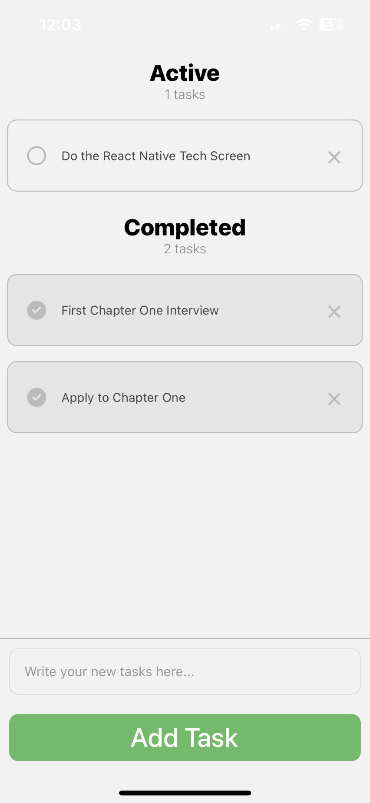

# Chapter One To-Do App

A simple task list app written in React Native



## Features

- Sleek and simple UI
- Live task counter
- Sectioned task list based on active and completed tasks
- Popup messages indicating tasks being added/completed/deleted

## Instructions

1. Enter a new task into the text input and then hit enter/return or click Add Task
2. Mark tasks complete by simply tapping on them
3. Delete tasks by tapping the X icon on it

## Getting Started

1. Install dependencies

   ```bash
   npm install
   ```

2. Start the app

   ```bash
    npx expo start
   ```

In the output, you'll find options to open the app in a

- [development build](https://docs.expo.dev/develop/development-builds/introduction/)
- [Android emulator](https://docs.expo.dev/workflow/android-studio-emulator/)
- [iOS simulator](https://docs.expo.dev/workflow/ios-simulator/)
- [Expo Go](https://expo.dev/go)

## 3rd Party Libraries

In order to make the user interface as intuitive and clean as possible, I made use of two libraries:

- [Font Awesome](https://fontawesome.com/) was used for certain icons in the app
   
- [react-native-flash-message](https://github.com/lucasferreira/react-native-flash-message) was used to create  flash messages to display information to the user

